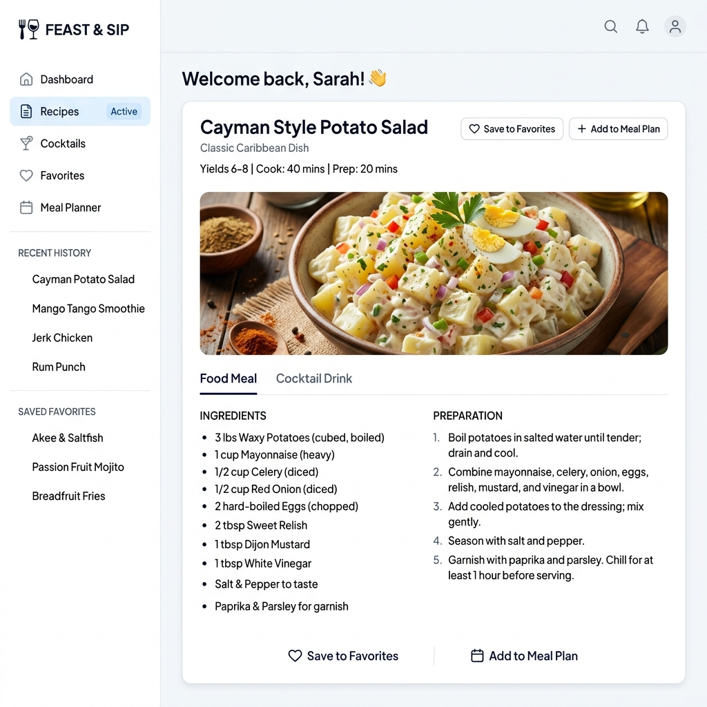
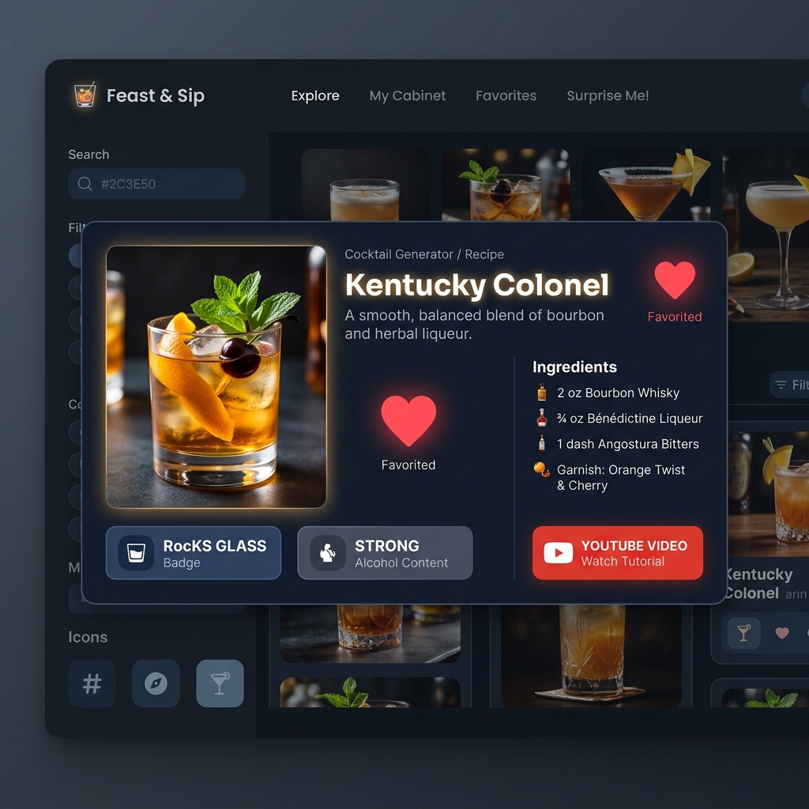
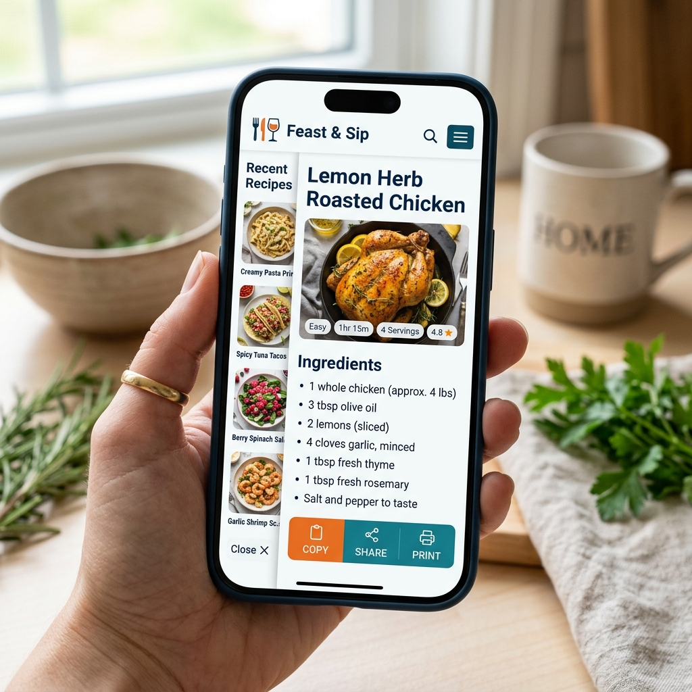

# Feast & Sip — Random Recipe & Cocktail Generator
## 🌐 Live App URL

**Live App:** https://feastsip.netlify.app/
A production-grade, highly aesthetic, fully accessible, and offline-resilient web application that generates random gourmet meal recipes and artisanal cocktail recipes at the touch of a button. Built with Vanilla HTML5, CSS3 (Tailwind CDN + Custom CSS System), and modular JavaScript (ES2020+). Zero build tools, zero frameworks, zero npm dependencies.

---

## Screenshots

| Light Mode Meal View | Dark Mode Cocktail View | Mobile & Print Layout |
| :---: | :---: | :---: |
|  |  |  |

---

## Problem & Target Audience

### The Real Problem Solved
**Decision Fatigue** and **Recipe Monotony** plague home cooks, busy professionals, hosts, and cocktail enthusiasts daily. When asking *"What should I cook tonight?"* or *"What drink can I mix right now?"*, users are forced to wade through ad-saturated blogs with 2,000-word backstories before finding an ingredient list.

### For Whom
- **Busy Home Cooks**: Seeking fast meal inspiration without spending 20 minutes searching.
- **Mixology Enthusiasts & Party Hosts**: Looking for new cocktail ideas, glass types, and prep steps.
- **Minimalist Users**: Who demand a clean, ad-free, instant-loading recipe interface that works seamlessly on desktop, tablet, mobile, and print.

---

## Features List

- **Segmented Dual-Source Toggle**: Seamlessly switch between **Food Meals** (TheMealDB) and **Cocktail Drinks** (TheCocktailDB) with `role="tablist"` / `role="tab"` keyboard accessibility. Switching tabs resets the canvas to an idle state without wasteful auto-fetching.
- **Surprise Me! Click-Coordinate Ripple**: Primary CTA buttons calculate exact click coordinates to trigger origin-based ripple animations. Disabled with `aria-busy="true"` while requests are in flight to prevent double-clicks.
- **Interactive Idle Card CTA**: Direct `🎲 Generate Random Meal Now` / `🍸 Generate Random Cocktail Now` button inside the empty state canvas for intuitive single-click generation.
- **Zero Cumulative Layout Shift (CLS) Skeleton Loaders**: Shimmer loaders occupy the exact computed height and aspect ratio of the final recipe card, guaranteeing 0 CLS during network loads.
- **Resilient 4-Mode Error Boundary**: Handles transport drops (`navigator.onLine === false`), HTTP status errors (non-2xx), JSON parse failures, and empty payloads (`meals: null` / `drinks: null`) with distinct console logging and an interactive Retry button.
- **Unified 20/15 Slot Ingredient Parser**: Single parser function (`parseIngredients`) handling 20 meal slots and 15 cocktail slots. Strips nulls, empty strings, and `"null"` literals while pairing ingredients with measures.
- **Smart Metadata Badging**: Conditional rendering for Area/Origin (Meals) or Alcoholic Strength & Glassware (Cocktails)—never displaying blank labels.
- **Lazy Imagery & Fallback Safety**: Recipe images feature `loading="lazy"` and an automated SVG fallback image on broken URLs.
- **Instruction Line-Clamping**: Preparation steps automatically format into clean paragraphs with a toggleable `Show More` / `Show Less` button for long recipes.
- **Persisted History Sidebar (Max 5)**: Tracks the 5 most recent generated items (deduped by API ID). Clicking any history item re-renders it instantly from local state without issuing a network request.
- **Saved Favorites**: One-click heart toggle with micro-animations allowing users to bookmark favorite recipes to `localStorage` (deduped by API ID).
- **Plain-Text Copy & Web Share**: One-click plain-text recipe clipboard copying (`navigator.clipboard` with prompt fallback) and native OS Web Share API support (`navigator.share`).
- **Dedicated `@media print` Stylesheet**: Pressing `Ctrl+P` isolates the recipe card full-width in high-contrast black-on-white text while automatically stripping headers, sidebars, buttons, and toasts.
- **Triple Theme Control (Light / Dark / System)**: Persistent theme selection saved in `localStorage`. System theme mode listens live to `window.matchMedia('(prefers-color-scheme: dark)')` without requiring page reloads.
- **WCAG AA Compliance**: High-contrast 3:1 focus visible rings, keyboard operability (Tab, Shift+Tab, Enter, Space), screen-reader live updates (`aria-live="polite"`), and reduced-motion query support (`prefers-reduced-motion: reduce`).

---

## The AI Feature

### What It Does
Feast & Sip is powered by an **Autonomous UI & Data Architectural Engine**. The AI agent parses unstructured data from random API payloads, normalizes variable ingredient-to-measure matrices, calculates dynamic instruction line clamping thresholds, and projects data through pure DOM rendering functions.

### System Prompt & Instructions Behind It
```markdown
Role: Principal Frontend Engineer, Senior UI/UX Designer, and JavaScript Architect.
Constraint Contract:
1. Output entire working application in full — zero placeholders, zero TODOs, zero omitted lines.
2. Architecture: Modular Vanilla JS (<script type="module">) separated into api.js, state.js, storage.js, render.js, app.js.
3. State: Single source of truth with Observer / Pub-Sub pattern. All UI is a pure function of state.
4. Robustness: Handle 4 failure modes distinctly (transport error, non-2xx status, JSON parse error, null/empty payload).
5. Ingredient Parser: Single shared parseIngredients(item, maxSlots) loop handling 20 slots for meals, 15 for cocktails.
6. Zero CLS: Skeleton loader occupies exact computed aspect-ratio height.
7. Print: Dedicated @media print stylesheet hiding sidebars/buttons and outputting clean black-on-white cards.
```

---

## Tools, Services, and AI Models Used

- **AI Model & Agent**: Antigravity AI powered by **Gemini 3.6 Flash (High Reasoning)**.
- **Core Stack**: HTML5, CSS3, Tailwind CSS CDN (`https://cdn.tailwindcss.com`), Vanilla JavaScript (ES2020+ Modules).
- **REST APIs**:
  - TheMealDB API (`https://www.themealdb.com/api/json/v1/1/random.php`)
  - TheCocktailDB API (`https://www.thecocktaildb.com/api/json/v1/1/random.php`)
- **Typography & Icons**: Google Fonts (`Plus Jakarta Sans`), Custom Native Inline SVG Icon System.
- **Image Generation**: Antigravity Image Generator (`generate_image`).
- **Browser APIs**: Web Storage API (`localStorage`), Web Clipboard API (`navigator.clipboard`), Web Share API (`navigator.share`), MatchMedia API (`window.matchMedia`).

---

## How to Run the Project

### Option 1: Direct File Launch (No Server Required)
1. Locate the workspace folder [d:\hakim](file:///d:/hakim).
2. Double-click [index.html](file:///d:/hakim/index.html) in your file manager to open it in Chrome, Edge, Firefox, or Safari.

### Option 2: Local HTTP Server
If you prefer running via a local dev server:

```bash
# Using Python (Built-in)
python -m http.server 8080 --directory d:/hakim

# Or using Node serve
npx serve d:/hakim -p 8080
```

Then open `http://localhost:8080` in your web browser.

---

## Deploying to Netlify (Zero Configuration)

Since this app is built with native static web standards (HTML5, CSS3, Vanilla JS ES Modules), it deploys to Netlify in seconds with **zero build configuration**!

### Method 1: Netlify Drag & Drop (Fastest — 30 Seconds)
1. Open your browser and navigate to **[app.netlify.com/drop](https://app.netlify.com/drop)**.
2. Open Windows File Explorer to `d:\hakim`.
3. Drag the `hakim` folder (or select all files inside) and drop it into the Netlify Drop box.
4. Netlify will deploy the application immediately and provide your live production URL (e.g. `https://feast-and-sip.netlify.app`).

### Method 2: Automatic Git Continuous Deployment
1. Push your project to GitHub, GitLab, or Bitbucket.
2. Log into the **Netlify Dashboard**, click **"Add new site"** → **"Import an existing project"**.
3. Select GitHub and choose your repository.
4. Leave **Build command** blank and set **Publish directory** to `.` (or root `/`).
5. Click **Deploy site**. Netlify will auto-deploy updates whenever you push commits!

---

## Project Directory Structure

```
d:\hakim/
├── index.html        # Main HTML5 document structure & semantics
├── README.md         # Full project documentation & details
├── css/
│   └── style.css     # CSS Variables, skeleton shimmer, print & focus rules
├── js/
│   ├── api.js        # API fetchers, ingredient parser & 4 error boundaries
│   ├── state.js      # Single state object & Observer / Pub-Sub pattern
│   ├── storage.js    # Safe localStorage operations with corrupt state recovery
│   ├── render.js     # Pure DOM rendering engine & toast notifications
│   └── app.js        # Event delegation, tab wiring, copy/share/print handlers
└── assets/
    ├── hero_light.png
    ├── cocktail_dark.png
    └── mobile_print.png
```
